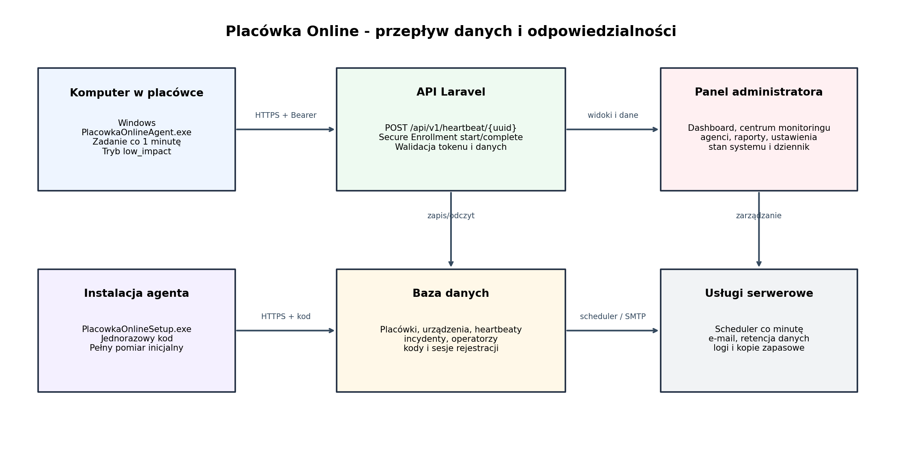

# Placówka Online

[](LICENSE)
[](composer.json)
[](composer.json)
[](docs/AGENT_BUILD.md)

**Placówka Online** to nieodpłatny projekt open source przeznaczony dla
jednostek samorządu terytorialnego oraz podległych im placówek. Pomaga
monitorować stan techniczny komputerów, szybciej wykrywać awarie i ograniczać
ryzyko wynikające z braku aktualizacji lub niesprawnej ochrony.

> Projekt wspiera administratora, ale nie zastępuje programu antywirusowego,
> zapory, kopii zapasowych, aktualizacji ani profesjonalnej obsługi IT.

## Najważniejsze funkcje

- heartbeat i status online/offline;
- Internet, DNS, brama i opóźnienia;
- CPU, RAM, dyski, system Windows i sieć;
- SMART, usługi Windows, Windows Update i ochrona antywirusowa;
- obsługa Microsoft Defender, ESET i innych dostawców rejestrowanych w
  Windows Security Center;
- bufor heartbeatów offline;
- incydenty, statusy workflow, operatorzy i dziennik bezpieczeństwa;
- raporty dostępności oraz kopie zapasowe;
- bezpieczna rejestracja agenta kodem jednorazowym;
- publiczne dokumenty: polityka prywatności, RODO i regulamin.

## Architektura



System składa się z panelu Laravel, bazy danych oraz lekkiego agenta Windows
napisanego w Go. Agent przesyła techniczną telemetrię przez HTTPS. Nie zawiera
funkcji rejestrowania klawiatury, wykonywania zrzutów ekranu, odczytu dokumentów
ani przechwytywania haseł.

## Szybki start

```bash
cp .env.example .env
composer install
php artisan key:generate

touch database/database.sqlite
php artisan migrate
php artisan placowka:create-admin admin@example.org --name="Administrator"

npm install
npm run build
php artisan serve
```

Szczegóły: [docs/INSTALLATION.md](docs/INSTALLATION.md).

## Agent Windows

Kod agenta znajduje się w:

```text
storage/app/agent-template/src/main.go
```

Budowa:

```bash
export PATH="$HOME/.local/go1.26.5/bin:$PATH"
bash scripts/build-agent-v1.9.2.sh "$PWD"
```

Instalator Inno Setup budowany jest na Windows. Zobacz
[docs/AGENT_BUILD.md](docs/AGENT_BUILD.md) i
[docs/CODE_SIGNING.md](docs/CODE_SIGNING.md).

## Prywatność i dane

Zakres danych opisano w [docs/DATA_COLLECTION.md](docs/DATA_COLLECTION.md).
Dokumenty prawne znajdują się w [docs/legal](docs/legal).

## Bezpieczeństwo

Luk bezpieczeństwa nie należy zgłaszać w publicznych Issues. Instrukcja
odpowiedzialnego zgłaszania znajduje się w [SECURITY.md](SECURITY.md).

## Licencja

Kod jest udostępniany na licencji **GNU AGPL-3.0-or-later**. Oznacza to m.in.,
że publicznie udostępniona przez sieć zmodyfikowana wersja powinna zapewnić
użytkownikom dostęp do odpowiadającego jej kodu źródłowego. Pełny tekst:
[LICENSE](LICENSE).

## Autor i kontakt

Adam Trojanowski — [it@it-serwis.net](mailto:it@it-serwis.net)

Strona projektu: https://monitoring.wcag-cms.pl
